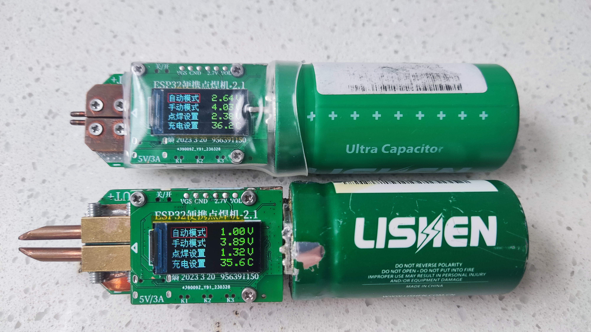
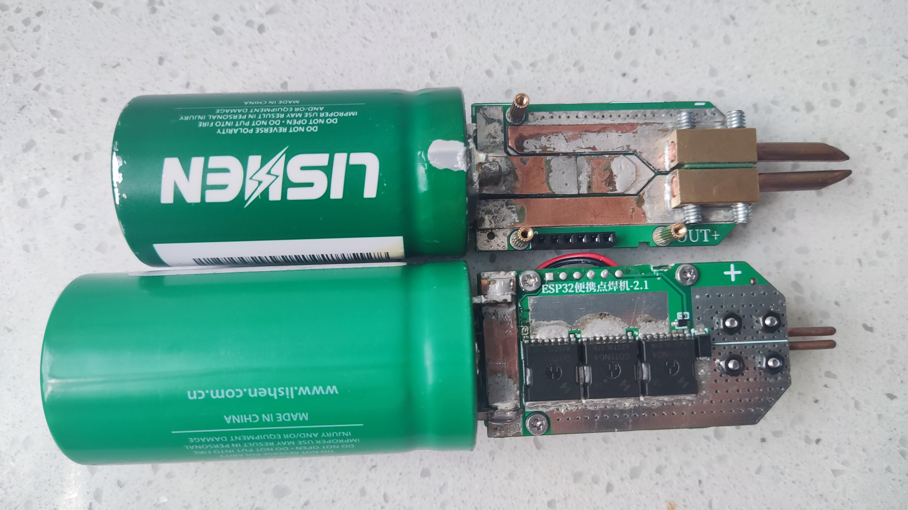
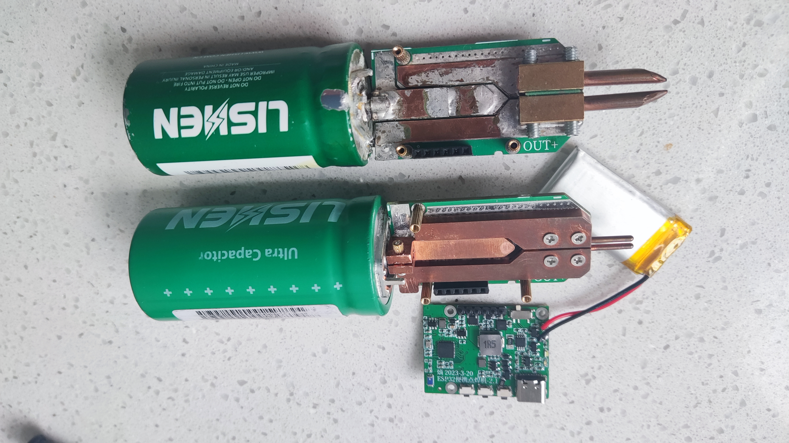
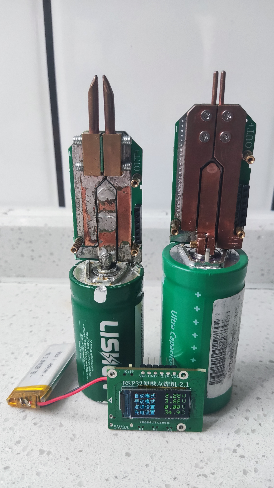
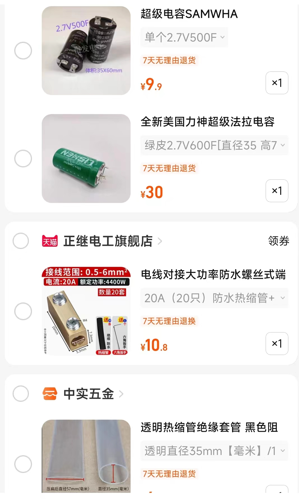

# ESP32便携点焊机2.1

#### ESP32便携点焊机是一款迷你便携能单手操控的超级电容点焊机 采用单节超级电容作为大电流电源 为点焊提供足够的瞬间输出功率 且分别有恒功率和恒电流充电电路为超级电容充电 来弥补超级电容充电慢和续航短的缺点  

#### 产品简介
1.  TYPE-C接口主要为ESP32 C3烧录程序和为设备充电（5V/2A）
2.  拥有TYPE-C-->超级电容 输入7.5W（5V/1.5A）恒功率充电 和 锂电池-->超级电容 最大输出0.8A恒流充电电路 并能独立控制开关
3.  支持USB电压 电池电压 电容电压和 焊件检测电压 温度等参数的采集和显示 
4.  0.96寸 ST7735  160*80显示屏 显示各种参数
5.  3个按键进行模式切换 参数设置 功能控制 和 一个拨动开关控制开关机
6.  拥有防超级电容电流倒灌电路 减小电容待机漏电流
7.  支持自动点焊和手动点焊模式 并能设置多脉冲焊接时间和次数
8.  拥有多种功能开关参数设置和过温保护欠压保护等

#### 功能模式
1.  上电初始页面：K2键选择对应的工作模式和参数设置  K1键选择进入或退出
2.  自动点焊模式：自动检测到焊件就位 自动执行预设的点焊参数流程进行点焊  
3.  手动点焊模式：K2键选择不同的工作模式  模式0：按下K3键 执行一次点焊参数流程   模式1：按下K3键开启点焊MOS 不按就关闭
4.  参数设置模式：K2键选择对应的设置参数名 K3键调整参数
5.  充电设置模式：开关键进入后  K3键设置不同的给电容充电模式 主要有自动模式和手动模式 手动模式下有不同的充电路径选择
 
#### 点焊设置
1.  默认点焊流程采用：点焊延时+预热脉冲+多个脉冲间隔时间和点焊脉冲的多脉冲组合模式也可以任意组合使用
2.  焊件检测阈值是用来检测焊件是否存在和电容电压分压的值
3.  实际使用时当电容电压低于2V时焊点将变不牢固 建议2V以上使用
4.  60mS高电平点焊一次 电容电压下降（0.05V~0.1V)左右 
5.  不同厚度点焊材料使用合适参数才能有更好的点焊效果  

#### 充电设置
1.  默认使用2.7V/600F超级电容和3.7V/400mAh锂电池最为测试样本 
2.  初次使用自动充电模式从0.1V自动充到2.7V 大概需要20分钟（因过温保护间歇性工作）
3.  自动充电模式从1V自动充到2.7V 大概需要8分钟
4.  手动充电模式中的 TYPE-C-->超级电容 从1V充到2.7V 大概需要8分钟
5.  手动充电模式中的 锂电池-->超级电容 从1V充到2.7V 大概需要20分钟
6.  手动充电模式中不充电模式 用于调试和运输 
7.  当USB和电池电压过低 或 温度>50℃ 将不执行充电功能 

#### 程序下载
1.  此程序基于Arduino IDE开发  源程序和依赖库在附件内  内有编译导出的烧录文件 
2.  编译环境： arduino1.8.19  /  esp32_package_2.0.5
3.  编译前需要安装相关库和选择对应的开发板芯片设置 相关参数和注意事项在源程序头部
4.  芯片初次下载程序时 连接USB不会识别 需要先拉低P9引脚（按下K2按键）然后打开电源开关进入强制下载模式
 
#### 硬件装配（高成本方案）
1.  该项目默认使用ESP32便携点焊机-2.1 PCB文件包含主控板和功率板 普通RF-4材质 2层板 板厚1.6mm
2.  ESP32便携点焊机主要由主控PCBA + 功率板PCBA + 超级电容 + 锂电池 + M2铜柱螺丝 + 导电铜块夹具 + 点焊焊针 + 透明热缩绝缘套组成
3.  超级电容默认使用2.7V/600F 4脚圆柱形封装的力神超级法拉电容器 详细信息看图
4.  锂电池使用的是3.7V/400mAh 602040封装的软包锂电池 如果空间足够锂电池容量越大越好
5.  导流铜块夹具一共有3件 分别是两件左右导流焊针夹具 一件电容端子导流夹具 由SOLIDWORKS 2021设计 用嘉立创进行CNC加工紫铜材料
6.  点焊焊针因导电铜块夹具限制只能使用直径1.8mm焊针 长度25mm左右 可以用1.8mm的紫铜棒自己加工打磨
7.  M2铜柱螺丝参数：双通铜柱(M2*3)x5当螺母用 +双通铜柱(M2*10)x3 +平头螺丝(M2*3)x6 + 平头螺丝(M2*9)x5
8.  透明热缩绝缘套 直径35mm 长度任意 以上装配器件参数都是不计成本用来提升点焊效果和使用体验

#### 硬件装配（低成本方案）
1.  用2.7V/500F扁脚电容很好装配但点焊效果不是很好  用2.7V/600F的力神4脚电容不使用导电铜块夹具极难焊接  个人选择使用其中一种即可 
2.  扁脚电容功率板与导流铜块夹具不兼容  需要自行裁剪紫铜板导流和黄铜材质的：方型一进一出接线端子(16x7.3x5.3mm）作为低成本替代 
3.  用4脚电容功率板不用导流铜块夹具能极大降低成本 但是需要自行裁剪紫铜板导流和黄铜材质的：方型一进一出接线端子(16x7.3x5.3mm）作为低成本替代 
4.  如果使用接线端子作为焊针夹具 那么焊针可选用直径4mm的紫铜棒自己加工打磨也可以买专业焊针 
5.  M2铜柱螺丝参数略有不同需要自行确认 其它器件参数基本差不多一样
6.  低成本方案是以牺牲点焊效果 装配难度和使用体验做为代价的 个人斟酌选择  

#### 注意事项
1.  此项目仅为个人爱好而创建开源 并非商业产品 不能确保它符合任何法规和安全要求 使用本项目产品所带来的任何风险和后果均由使用者自行承担
2.  使用本产品必须遵循相关法律法规，不得用于非法活动 使用本产品即表示您已经阅读并同意本免责声明
3.  由于单节超级电容电压只有2.7V 在整体内阻一定的情况下无法输出更大的电流 导致点焊0.2mm以上的镍带时焊点不牢 点焊0.1mm的镍带完全没问题 
4.  元件参数以原理图为准 嘉立创没有的元件上淘宝 相关软硬件资料都在附件内 此项目大量使用0402封装元件 且结构复杂 不建议小白进行复刻
5.  此项目为 CC BY-SA 3.0 开源项目 如需大批量生产商用必需找原作者进行授权 自用和<100套商用售卖随意 

#### 交流平台
1.  此项目仅为个人爱好而创建开源 欢迎各位开发者 爱好者参与并共同完善和推进项目的发展
2.  立创开源：https://oshwhub.com/fj956391150/pian-xie-dian-han-ji
3.  Gitee开源：https://gitee.com/arduino2021/esp32-portable-spot-welder-2.1.git
4.  QQ交流群：619331673
5.  熵 2023-5-14

#### 实物展示

